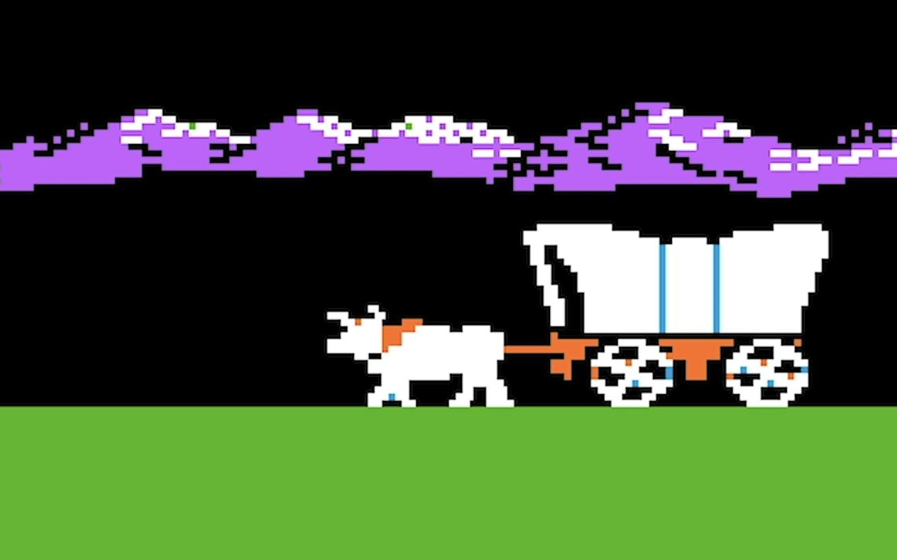
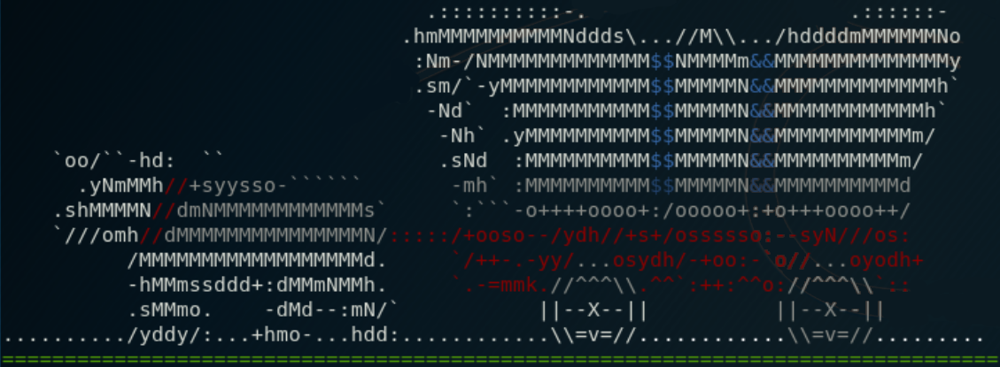
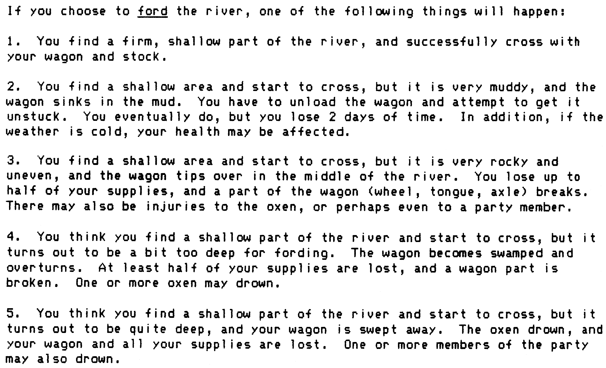
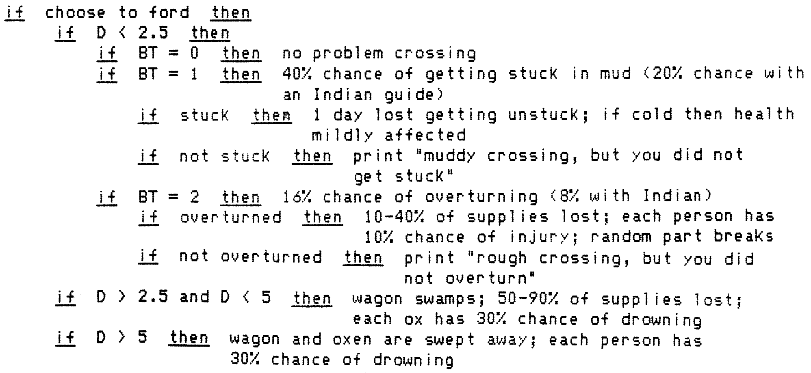
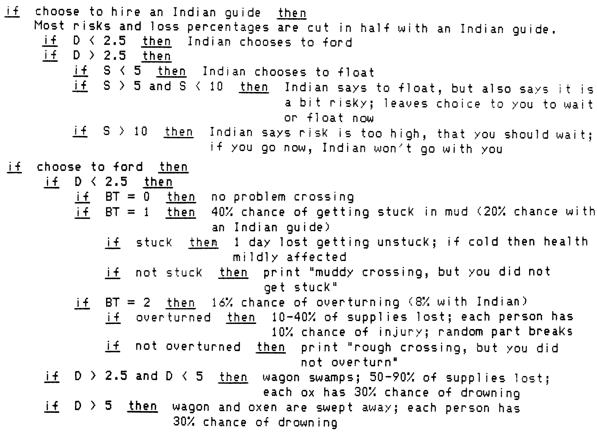

# The Oregon Trail (Python)

## Features

### Wagon Animation

Using [text-image](https://www.text-image.com/convert/ascii.html) to convert an image to ASCII art, I've created a 4-second animation of the traditional "Oregon Trail ox and wagon" trekking across the screen.

Original image used:



Output:

```
          .^7?!^...      :~7~~:    .~~^~:..         . .:^!JY7::::.              
 .^..:^~!?YGPYPG5PP?7~~7JY5PPBGY77YPG#BBBYGPY7:.:^~!~~7JJYPGG55P5Y?~~^.   .:^~^7
JYY??JYY5YYY7~?JJJ?~!?JYYYYJ?~^~7JYJJJYYYYPPYJ!~7!?Y?!?YYY?7JJJYYJYY5G55G5Y5P55P
J??!!!!!!!^^:  ........^^^^..   ......:^^^^~:.!!^!????7!!!!!!~^~~!!?YYJJJ7!~^^^^
                                                                    ...         
                                              :YGGBGGBPJJ!^.~~~.^?JJYGGGBY      
                                              .GG!B@@@@@@@#G@@@G#@@@@@@@@P      
                                               :#7 Y@@@@@@#B@@@B#@@@@@@@G       
                             :^.:7.             !&~ #@@@@@#B@@@B#@@@@@@G:       
                             ~5##@J75P557Y5Y!.  .J~:5PPGBG55GGG5PPPGBGG!        
                             7J5BBB&@@@@@@@@G^^^^7J?~?5?JPJJ7JY?~J5?JPJ7        
                                .J@@BY5Y7##&5    :~ ^Y?GG5JY.~! ^GJGG55G.       
^^^^^^^^^^^^^^^^^^^^^^^^^^^^^^^^~G555^::JB!5&J^^^^:^^7PG?PY~^^:^^!PBJ5P!^^^^^^^^
YYYYYYYYYYYYYYYYYYYYYYYYYYYYYYYYYYYYYYYYYYYYYYYYYYYYYYYYYYYYYYYYYYYYYYYYYYYYYYYY
YYYYYYYYYYYYYYYYYYYYYYYYYYYYYYYYYYYYYYYYYYYYYYYYYYYYYYYYYYYYYYYYYYYYYYYYYYYYYYYY
YYYYYYYYYYYYYYYYYYYYYYYYYYYYYYYYYYYYYYYYYYYYYYYYYYYYYYYYYYYYYYYYYYYYYYYYYYYYYYYY
YYYYYYYYYYYYYYYYYYYYYYYYYYYYYYYYYYYYYYYYYYYYYYYYYYYYYYYYYYYYYYYYYYYYYYYYYYYYYYYY
YYYYYYYYYYYYYYYYYYYYYYYYYYYYYYYYYYYYYYYYYYYYYYYYYYYYYYYYYYYYYYYYYYYYYYYYYYYYYYYY
YYYYYYYYYYYYYYYYYYYYYYYYYYYYYYYYYYYYYYYYYYYYYYYYYYYYYYYYYYYYYYYYYYYYYYYYYYYYYYYY
```

Additionally, I used a [larger version](https://media.mathstodon.xyz/media_attachments/files/000/723/954/original/4b0b8f7eafb15e10.png) for the "welcome" art.



```
                                  .::::::::::-.                     .::::::-
                                .hmMMMMMMMMMMNddds\...//M\\.../hddddmMMMMMMNo
                                 :NM-/NMMMMMMMMMMMMM$$NMMMMm&&MMMMMMMMMMMMMMy
                                 .sm/`-yMMMMMMMMMMMM$$MMMMMN&&MMMMMMMMMMMMMh`
                                  -Nd`  :MMMMMMMMMMM$$MMMMMN&&MMMMMMMMMMMMh`
                                   -Nh` .yMMMMMMMMMM$$MMMMMN&&MMMMMMMMMMMm/
    `oo/``-hd:  ``                 .sNd  :MMMMMMMMMM$$MMMMMN&&MMMMMMMMMMm/
      .yNmMMh//+syysso-``````       -mh` :MMMMMMMMMM$$MMMMMN&&MMMMMMMMMMd
    .shMMMMN//dmNMMMMMMMMMMMMs`     `:```-o++++oooo+:/ooooo+:+o+++oooo++/
    `///omh//dMMMMMMMMMMMMMMMN/:::::/+ooso--/ydh//+s+/ossssso:--syN///os:
          /MMMMMMMMMMMMMMMMMMd.     `/++-.-yy/...osydh/-+oo:-`o//...oyodh+
          -hMMmssddd+:dMMmNMMh.     `.-=mmk.//^^^\\.^^`:++:^^o://^^^\\`::
          .sMMmo.    -dMd--:mN/`           ||--X--||          ||--X--||
........../yddy/:...+hmo-...hdd:............\\=v=//............\\=v=//.........
```

---

## Stopping to Rest

During game play, you can stop to rest between 1-9 days.

Resting will continue to deplete your food, and the normal day/weather cycles persist for each day.

## Trading

During game play, you can attempt to trade.

- No one wants to trade with you today.
- You meet another emigrant who wants 1 set of clothing. He will trade you 30 pounds of food.
- You meet another emigrant who wants 1 ox. He will trade you 1 set of clothing.
- You meet another emigrant who wants 1 wagon wheel. He will trade you 26 pounds of food.
- You meet another emigrant who wants 1 ox. She will trade you 104 bullets.
- You meet another emigrant who wants 1 set of clothing. She will trade you 47 bullets.
- You meet another emigrant who wants 1 wagon tongue. He will trade you 73 bullets.
- You meet another emigrant who wants 1 wagon tongue. He will trade you 25 pounds of food.
- You meet another emigrant who wants 1 ox. She will trade you 1 set of clothing.


## Crossing Rivers

During game play, there are four (4) river crossings.
Depending on the weather and river data, the crossing can vary anywhere between harmless and cause of death.

Possible river crossing outcomes:

- safe crossing
- swamping
- overturning
- swept away
- stuck in mud (It was a muddy crossing, but you did not get stuck.)

https://www.died-of-dysentery.com/stories/crossing-rivers.html

### Original Algorithms



Algorithm for fording a river:
- **D** = depth
- **BT** = bottom type (smooth and firm || muddy || rocky and uneven)



Hiring an Indian:
- **D** = depth
- **S** = swiftness
- **BT** = bottom type (smooth and firm || muddy || rocky and uneven)



**Bottom Types**

| River | Type | Value |
| --- | --- | --- |
| Kansas | Smooth and Firm | 0 |
| Big Blue | Muddy | 1 |
| Green | Rocky and Uneven | 2 |
| Snake | Rocky and Uneven | 2 |

### Fording the River

Unless the player is crossing an extremely shallow river, **fording** a river always has a 0% chance of success.
The chance of success can be raised using the same methods as when the player caulks the wagon.

```python
if D < 2.5:
    if BT == 0:  # smooth
        # You made the crossing successfully.
    elif BT == 1:  # muddy
        # 40% chance of getting stuck in mud
        if stuck_in_mud:
            # You become stuck in the mud. Lose 1 day.
        else:
            # It was a muddy crossing, but you did not get stuck.
    elif BT == 2:  # rocky
        # 16% chance of overturning
        if overturned:
            # Risk factor V between 10%-40%.
            # For each category of supplies that you still own,
            # V determines the odds that you lose something in that category.
            # For each category that you lose some supplies,
            # your actual loss is a random value between 0%-100% for that category.
elif D >= 2.5 and D < 3:
    # Your supplies get wet, and you lose a day.
    # Never gets stuck, and never overturns.
    # (unrealistic irl, but simplifies the algorithm)
elif D >= 3:
    # Wagon tips over.
    # Three different risk factors are computed.
    # The risk of losing something in each category of supplies is (D/10)/IX,
    # where IX=1 if you have no guide, and IX=5 if you have a guide.
    # Therefore, if the river is >=10ft deep and you have no guide,
    # then there is a 100% chance of loss in each category of supplies,
    # although the actual loss in each category is a random value between 0%-100%.
    # The risk of losing oxen is ((D-1)/10)IX for each ox.
    # The risk of losing a party member is ((D-2.5)/10)/IX.
    # Therefore, if the river is >=12.5ft deep, and you try to ford it without a guide,
    # you are guaranteed to lose a party member.

# NOTE: Most of these risks are reduced by 80% if you hire a Native American guide.
```

### Floating Across / Caulking

The chances of successfully caulking the wagon to cross a river depends on the water level,
speed of the current, and condition of the wagon.
Also, like the "ford" option, the player can rest before crossing the river to wait for more suitable crossing conditions.

```python
if D < 1.5:
    # The river is too shallow to float across.
elif D >= 1.5:
    # Spend one day (caulking, etc.)
    if D <= 2.5:
        # You had no trouble floating the wagon across.
    elif D > 2.5:
        # Risk of tipping over is (S/20)/IX.
        if wagon_tips_over:
            # Risk of losses is based on S.
            # Risk of losing something in each category of supplies is (0.4+S/25)/IX.
            # For each category in which you lose supplies, the loss is a random value between 0%-100% of that category.
            # No oxen are lost, because they were not hitched to the wagon.
            # The risk of losing a party member is ((S-3)/15)/IX.
            # Therefore, if the river swiftness is >= 18,
            # then you are guaranteed to lose someone in your party.
```

### Taking the Ferry / Hire an Indian

The ferry costs money to use, although the odds of crossing are significantly higher by using a ferry.
The cost of a ferry crossing is $5.
The cost of hiring an Indian is between 2-6 sets of clothing.
Also, like the "ford" and "float" options, the player can rest before crossing the river to wait for more suitable crossing conditions.

```python
if D < 2.5:
    # The ferry is not operating today because the river is too shallow.
elif D >= 2.5:
    # The ferry operator says that he will charge you $5.00 and that you will have to wait 2-6 days. Are you willing to do this?
    if cash < 5:
        # You do not have enough money to pay for the ferry.
    else:
        if S <= 5:
            # The ferry got your party and wagon safely across.
        elif S > 5 and S <= 10:
            # Risk of a problem is 5%*.
        elif S > 10:
            # Risk of a problem is 15%*.

# * Risk:
# The ferry broke loose from moorings. You lose: (list)
# The risk of losing something in each category of supplies is 80%.
# For each category in which you lose supplies,
# the loss is a random value between 0%-100% in that category.
# The risk of losing oxen is 50% for each ox.
# The risk of losing a party member is 20%.
```

Order of operations to display lost supplies:

- clothing
- bullets
- wheels
- axles
- tongues
- food
- oxen
- party members

---

## Random Names

Should you decide not to select your family/friends' names, there's a predefined list of names:

| Females | Males |
| --- | --- |
| Anna | Henry |
| Beth | Jed |
| Emily | Joey |
| Mary | John |
| Sara | Zeke |

---

## Supplies

You will be required to carry supplies with you to help make the arduous journey to Oregon.

| Resource | Min | Max | Notes |
| --- | :---: | :---: | --- |
| wagon | 1 | 1 | |
| oxen yoke | 1 | 10 | 1 yoke = 2 oxen |
| food | 1,000 | 2,000 | pounds of food |
| clothing | 10 | 200 | sets of clothing |
| ammunition | 1 | 10,000 | 1 box = 20 bullets |
| wagon wheel | 0 | 3 | |
| wagon axel | 0 | 3 | |
| wagon tongue | 0 | 3 | |

---

## Hunting

### Sounds

Onomatopoeia words for gunfire/shots:

- bang
- pow
- wham
- pew pew
- boom
- kablam
- kaboom

### Animals

| Animal | Speed | Location | Weight |
| --- | --- | --- | --- |
| Bison | slow | plains | 852-991 lbs |
| Bear | slow | mountains | 104-170 lbs |
| Deer | medium | anywhere | 54-74 lbs |
| Rabbit | fast | anywhere | 2lbs |
| Squirrel | fast | anywhere | 1lb |

---

## Health

While alive, there are four (4) different health states you and your party can encounter: good / fair / poor / very poor.

There's a global health points system in place, that can fluctuate drastically from many aspects of the game play.

Players start with 0 points, which is the ideal health.

| Health | Points |
| :---: | :---: |
| good | 0-34 |
| fair | 35-78 |
| poor | 79-104 |
| very poor | 105-139 |

Remaining party members all die in a matter of days, if the points are above 140+.

Each day the health value is decremented by 10% naturally.

### Health (based on Weather)

The weather also causes health to fluctuate.

| Weather | Points | Notes |
| :---: | :---: | --- |
| Very Hot | +2 | |
| Hot | +1 | |
| Cool | +0 | Ideal weather, no change |
| Warm | +0 | Ideal weather, no change |
| Cold | +0 | if at least 2+ sets of clothing per person |
| | +1 | if at least 1 set of clothing per person |
| | +2 | if 0 sets of clothing per person |
| Very Cold | +0 | if at least 4+ sets of clothing per person |
| | +1 | if at least 3 sets of clothing per person |
| | +2 | if at least 2 sets of clothing per person |
| | +3 | if at least 1 set of clothing per person |
| | +4 | if 0 sets of clothing per person |

Sliding scale: `Math.floor(sets of clothing / persons alive)`

### Health (based on Food rations)

The player's food rations also causes health to fluctuate.

| Rations | Points |
| :---: | :---: |
| Filling | +0 |
| Meager | +2 |
| Bear Bones | +4 |
| No Food | +6 |

### Health (based on Travel Pace)

The player's travel pace also causes health to fluctuate.

| Pace | Points |
| :---: | :---: |
| Rest Day | +0 |
| Steady | +2 |
| Strenuous | +4 |
| Grueling | +6 |

* Note: on days where the player is prevented from traveling, the points do not increase (+0).

### Health (based on Random Events)

Random events can also cause health to fluctuate.

| Misfortune | Points | Notes |
| :---: | :---: | --- |
| Bad water | +20 | |
| Very little water | +10 | |
| Diseased party member | +20 | only when the desease first happens |
| Rough trail | +10 | |

---

## Travel Pace

During game play, you are able to adjust the pace at which your party travels to Oregon.

| Pace | Distance (miles per day) |
| --- | :---: |
| steady | 18 mi/day |
| strenuous | 30 mi/day |
| grueling | 36 mi/day |

---

## Food Consumption

During game play, you are able to adjust the food rationing; the rate at which your party consumes food.

| Ration | Amount | Consumed (pounds per person, per day) |
| --- | --- | :---: |
| filling | meals are large and generous | 3 lbs/pp/day |
| meager | meals are small, but adequate | 2 lbs/pp/day |
| bare bones | meals are very small; everyone stays hungry | 1 lb/pp/day |

---

## Climate and Weather

As the player travels along the trail, each day’s weather is based on the current month,
and the player’s current location along the trail.

The simulation retrieves the corresponding average temperature, and adds or subtracts a random deviation.
The simulation also retrieves the odds of rainfall, and then generates conditions that may be
dry, rainy, or very rainy. If the weather is very cold, then snow replaces rain.

Weather can have affect many aspects of the game, including river levels, health, forward progress, random events, etc.

To be as realistic as possible to generate temperatures and rainfall, your current location on the trail, and time of year, are based on six distinct geographical zones.

| Zone | Starting Landmark | Ending Landmark | Data based on... |
| --- | --- | --- | --- |
| 1 | Independence, MO | Fort Kearney | Kansas City, MO |
| 2 | Fort Kearney | Fort Laramie | North Platte, NE |
| 3 | Fort Laramie | Independence Rock | Casper, WY |
| 4 | Independence Rock | Fort Hall | Lander, WY |
| 5 | Fort Hall | The Dalles | Boise, ID |
| 6 | The Dalles | Willamette Valley, OR | Portland, OR |

Each of the six zones contain climate data for each of the 12 months of the year.
This includes average daily temperatures, and average monthly precipitation.

For daily weather, the script extracts the average temperature for that month/zone combo (in Fahrenheit), and then randomly chooses a value between -20 and +20 (from that average temperature), to determine the actual temperature for that day.

| Weather | Temperature |
| --- | --- |
| Very Hot | > 90°F |
| Hot | 70°F-90°F |
| Warm | 50°F-70°F |
| Cool | 30°F-50°F |
| Cold | 10°F-30°F |
| Very Cold | < 10°F |

To determine the probability of it raining on a particular day, the script will extract the average monthly precipitation for that month/zone combo (in inches), and then is multiplied by 3%.

For example, the if the average monthly rainfall in a zone was 4.8 inches, then 4.8 * 3% gives you a 14.4% chance that it will rain on any given day in that month, in that zone.

Once the percentage is calculated, then there is a 30% chance that it will be a "heavy" rain (0.8 inches), and a 70% chance that it will be a "light" rain (0.2 inches).
If the current temperature is "cold" or "very cold", then snow falls instead of rain (8 inches for heavy snow, and 2 inches for light snow).
On rainy or snowy days, the weather is reported to the player as "rainy", "very rainy", "snowy", or "very snowy".

To make the weather a bit more realistic, there's one final twist to the weather data.
On each daily cycle, the application will decide whether to generate "new" weather, or to repeat the previous day's weather.
There is a 50% chance of repeating the previous day's weather, and therefore a 50% chance that new weather will be generated.
The new weather could potentially be the same as the old weather, regardless.

Snowfall accumulates on the ground, and rainfall accumulates as ground and surface water.
Each day, 10% of the accumulated rainfall disappears, and then today's rainfall (if any) is added in.

If the accumulated rainfall drops below 0.2 inches, then drought occurs.
If the accumulated rainfall drops below 0.1 inches, then the drought becomes severe, and the player is given drought messages ("insufficient grass", "inadequate water", "bad water").

Each day, 3% of the accumulated snowfall disappears if the weather is very cold, cold, or cool, but not very rainy.
If the weather is warm, hot, very hot, or very rainy, then 5 inches of snow melts, and is converted to 0.5 inches of water.

---

## Random Events / Misfortunes

| Event | Probability | Notes |
| --- | :---: | --- |
| Indians help find food | 5% | If you are completely out of food, then there is a 5% chance each day that local Indians will give you 30 pounds of food. |
| Severe thunderstorms | varies | The probability is based on the average precipitation for your current location and current month. |
| Severe blizzard | 15% | There is a 15% chance each day in which the temperature is either cold or very cold. |
| Heavy fog | 6% | After Fort Hall, a 6% chance each day, except when the temperature is very hot. 50% chance of also losing a day's travel.|
| Hail storm | 6% | Before Fort Hall, a 6% chance each day in which the temperature is very hot. |
| Injured or dead ox | 2%-3.5% | 2% each day on the prairie; 3.5% chance each day in the mountains. If all oxen are healthy, then one becomes injured; otherwise, the sick ox dies. |
| Injured party member | 2%-3.5% | (broken arm or leg) 2% chance each day on the prairie; 3.5% chance each day in the mountains. The person who gets injured is chosen randomly. |
| Snake bite | 0.7% | 0.7% chance each day. |
| Lose trail | 2% | 2% chance each day. |
| Wrong trail | 1% | 1% chance each day. |
| Rough trail | 2.5% | In mountains only; 2.5% chance each day. |
| Impassible trail | 2.5% | In mountains only; 2.5% chance each day. |
| Finding wild fruit | 4% | May to September only; 4% chance each day. The food supply is increased by 20 pounds. |
| Fire in the wagon | 2% | Some supplies are lost. |
| Lost party member | 1% | Lose up to 5 days. |
| Ox wanders off | 1% | Lose up to 3 days. |
| Finding an abandoned wagon | 2% | Some supplies are gained. |
| Thief comes during the night | 2% | Some supplies are lost. |
| Bad water | 10% | 10% chance each day in which the accumulated rainfall is below 0.1 inch. |
| Inadequate water | 20% | 20% chance each day in which the accumulated rainfall is below 0.1 inch. |
| Insufficient grass | 20% | 20% chance each day in which the accumulated rainfall is below 0.1 inch. |
| Illness | 0%-40% | Depending upon the health of the party. The person and the disease are chosen randomly. |

---

## Landmarks

There are three branch points in the game, where the player must decide whether to go left or right.
Consequently there are 20 trail segments in the network connecting these 18 points.
However, in a typical game, the player passes just 16 landmarks and travels 15 trail segments.

| ID | Landmark | Type | Region | Next Landmark | Next Landmark | Buy Supplies | Hire Indian | Hire Ferry |
| :--: | --- | :---: | --- | --- | :---: | :---: | :---: | :---: |
| L01 | Independence, Missouri | START | Prairie | Kansas River Crossing | 102 miles | ✅ | | |
| L02 | Kansas River Crossing | River | Prairie | Big Blue River Crossing | 82 miles | | ❌ | ✅ |
| L03 | Big Blue River Crossing | River | Prairie | Fort Kearney | 118 miles | | ❌ | ❌ |
| L04 | Fort Kearney | Fort | Prairie | Chimney Rock | 250 miles | ✅ | | |
| L05 | Chimney Rock | Misc | Prairie | Fort Laramie | 86 miles | | | |
| L06 | Fort Laramie | Fort | Prairie | Independence Rock | 190 miles | ✅ | | |
| L07 | Independence Rock | Misc | Prairie | South Pass | 102 miles | | | |
| L08 | South Pass | Misc | Mountains | Green River Crossing | 57 miles | | | |
| | | | Mountains | Fort Bridger | 125 miles | | | |
| L09 | Green River Crossing | River | Mountains | Soda Springs | 143 miles | | ❌ | ✅ |
| L10 | Fort Bridger | Fort | Mountains | Soda Springs | 162 miles | ✅ | | |
| L11 | Soda Springs | Misc | Mountains | Fort Hall | 57 miles | | | |
| L12 | Fort Hall | Fort | Mountains | Snake River Crossing | 182 miles | ✅ | | |
| L13 | Snake River Crossing | River | Mountains | Fort Boise | 113 miles | | ✅ | ❌ |
| L14 | Fort Boise | Fort | Mountains | Blue Mountains | 160 miles | ✅ | | |
| L15 | Blue Mountains | Misc | Mountains | Fort Walla Walla | 55 miles | | |
| | | | Mountains | The Dalles | 125 miles | | | |
| L16 | Fort Walla Walla | Fort | Mountains | The Dalles | 120 miles | ✅ | | |
| L17 | The Dalles | Misc | Mountains | Willamette Valley, Oregon | 100 miles | | | |
| L18 | Willamette Valley, Oregon | END | Mountains | | | | | |

### **Independence, Missouri**
- The start of your journey to Oregon!

#### Attempt to Trade

- You meet another emigrant who wants 2 wagon tongues. He will trade you 1 ox.
- You meet another emigrant who wants 1 wagon wheel. He will trade you 76 bullets.
- You meet another emigrant who wants 391 bullets. She will trade you 1 ox.

#### Talk to People

- A town resident tells you:
    - "Some folks seem to think that two oxen are enough to get them to Oregon! Two oxen can barely move a fully loaded wagon, and if one of them gets sick or dies, you won't be going anywhere. I wouldn't go overland with less than six."
- A trader named Jim tells you:
    - "Better take extra sets of clothing. Trade 'em to Indians for fresh vegetables, fish, or meat. It's well worth hiring an Indian guide at river crossings. Expect to pay them! They're sharp traders, not easily cheated."
- A traveler, Miles Hendricks, tells you:
    - "Did you read the Missouri Republican today? --Says some folk start for Oregon without carrying spare parts, not even an extra wagon axle. Must think they grow on trees! Hope they're lucky enough to find an abandoned wagon."

#### Buy Supplies

| Resource | Price | Amount |
| --- | --- | --- |
| Oxen | $20.00 | per ox |
| Clothing | $10.00 | per set |
| Ammunition | $2.00 | per box of 20 |
| Wagon wheels | $10.00 | per wheel |
| Wagon axles | $10.00 | per axle |
| Wagon tongues | $10.00 | per tongue |
| Food | $0.20 | per pound |

### **Kansas River**
- weather: cool/hot
- width: between 608-648 feet wide
- depth: between 2.1-7.4 feet deep

Choices:
- ford
- caulk/float
- ferry ($5.00 + wait 2-6 days)
- wait (between 1-6 days)

#### Attempt to Trade

- You meet another emigrant who wants 1 wagon wheel. He will trade you 1 set of clothing.
- You meet another emigrant who wants 120 pounds of food. He will trade you 1 ox.
- You meet another emigrant who wants 216 pounds of food. She will trade you 1 ox.

#### Talk to People

- A stranger tells you:
    - "Can't afford to take a ferry We're making our wagon into a boat. We'll turn it over, caulk the bottom and sides with pitch, and use it to float our goods across. Have to swim the animals. Hope it doesn't rain -- the river's high enough!"
- A ferry operator tells you:
    - "Don't try to ford any river deeper than the wagon bed -- about two and a half feet. You'll swamp your wagon and lose your supplies. You can caulk the wagon bed and float it -- or be smart and hire me to take your wagon on my ferry!"
- Aunt Rebecca Sims tells you:
    - "With the crowds of people waiting to get on the ferry, we could be stranded here for days! Hope there's enough graze for all those animals -- not many people carry feed! I'd rather wait, though, than cross in a rickety wagon boat!"

### **Big Blue River**
- weather: cool/warm
- width: between 221-248 feet wide
- depth: between 1.1-4.8 feet deep

Choices:
- ford
- caulk/float
- wait (between 1-6 days)

#### Attempt to Trade

- You meet another emigrant who wants 1 ox. He will trade you 135 bullets.
- No one wants to trade with you today.
- You meet another emigrant who wants 1 wagon tongue. She will trade you 1 set of clothing.
- You meet another emigrant who wants 1 wagon axle. He will trade you 1 set of clothing.

#### Talk to People

- A lady, Marnie Stewart, tells you:
    - "This prairie is mighty pretty with all the wild flowers, and tall grasses. But there's too much of it! I miss not having a town nearby. I wonder how many days until I see a town -- a town with real shops, a church, people..."
- Big Louie, a trail driver, tells you:
    - "Be careful you don't push those animals too hard! Keep 'em moving but set them a fair pace. Can't keep driving 'em so fast or you'll end up with lame-footed animals. A lame ox is about as good to you as a dead one!"
- A party leader heading east tells you:
    - "We've had enough! Pesky flies all day and mosquitoes all night! It's either baking sun or oceans of mud -- and sometimes both. Worry over Indians attacking -- haven't seen any yet, but still a worry."

### **Fort Kearney**

#### Attempt to Trade

- No one wants to trade with you today.
- You meet another emigrant who wants 1 wagon tongue. He will trade you 54 bullets.
- You meet another emigrant who wants 1 ox. He will trade you 81 pounds of food.

#### Talk to People

- A fort soldier tells you:
    - "The trials from the jumping off places -- Independence, St. Joseph, Council Bluffs -- come together at Fort Kearney. This new fort was built by the U.S. Army to protect those bound for California and Oregon."
- Big Louie tells you:
    - "The Platte River valley forms a natural roadway from Fort Kearney to Fort Laramie. Travelers bound for California, Utah, and Oregon all takes this road. Could be the easiest stretch of the whole trip. Should see antelope and plenty of buffalo."
- A Fort Kearney scout tells you:
    - "The game is still plentiful along here, but gettin' harder to find. With so many overlanders, I don't expect it to last more'n a few years. Folks shoot the game for sport, take a small piece, and let the rest rot in the sun."

#### Buy Supplies
| Resource | Price | Amount |
| --- | --- | --- |
| Oxen | $25.00 | per ox |
| Clothing | $12.50 | per set |
| Ammunition | $2.50 | per box of 20 |
| Wagon wheels | $12.50 | per wheel |
| Wagon axles | $12.50 | per axle |
| Wagon tongues | $12.50 | per tongue |
| Food | $0.25 | per pound |

### **Chimney Rock**

#### Attempt to Trade

- No one wants to trade with you today.
- You meet another emigrant who wants 1 wagon wheel. She will trade you 50 bullets.
- You meet another emigrant who wants 2 wagon wheels. She will trade you 1 ox.
- You meet another emigrant who wants 1 wagon wheel. He will trade you 23 pounds of food.
- You meet another emigrant who wants 4 sets of clothing. He will trade you 1 ox.

#### Talk to People

- Alonzo Delano tells you:
    - "About noon yesterday we came in sight of Chimney Rock looming up in the distance like the lofty tower of some town. We did not tire gazing on it. It was about 20 miles from us, and stayed in sight 'til we reached it today."
- Aunt Rebecca Sims tells you:
    - "I hear terrible stories about wagon parties running out of food before Oregon -- the whole party starving to death. We must check our supplies often; we might not get there as soon as we think. Always plan for the worst, I say."
- Celinda Hines tells you:
    - "Chimney Rock by moonlight is awfully sublime. Many Indians came to our wagon with fish to exchange for clothing. We bought a number. They understand 'swap' and 'no swap'. Seem most anxious to get shirts and socks."

### **Fort Laramie**

#### Attempt to Trade

- No one wants to trade with you today.
- You meet another emigrant who wants 4 wagon wheels. You don't have this.
- You meet another emigrant who wants 1 wagon tongue. He will trade you 28 pounds of food.
- You meet another emigrant who wants 1 wagon wheel. She will trade you 1 set of clothing.

#### Talk to People

- A mountain man tells you:
    - "These greenhorns heading across the Rockies know nothing about surviving in the mountains. It gets awful cold up there, even in summer. Many a traveler crossing the mountains too late in the year has gotten snowbound and died!"
- A Sioux brave tells you:
    - "The Pawnee are the mortal enemies of the Sioux. I would not hesitate to kill any Pawnee I met. But I have never killed a white man. All I ask from the white man is to leave me alone, and to leave my buffalo alone."
- A woman traveler tells you:
    - "Be warned, stranger. Don't dig a water hole! Drink only river water. Salty as the Platte River is -- it's better than cholera. We buried my husband last week. Could use some help with this harness, if you can spare the time."

#### Buy Supplies
| Resource | Price | Amount |
| --- | --- | --- |
| Oxen | $30.00 | per ox |
| Clothing | $15.00 | per set |
| Ammunition | $3.00 | per box of 20 |
| Wagon wheels | $15.00 | per wheel |
| Wagon axles | $15.00 | per axle |
| Wagon tongues | $15.00 | per tongue |
| Food | $0.30 | per pound |

### **Independence Rock**

#### Attempt to Trade

- No one wants to trade with you today.
- You meet another emigrant who wants 1 wagon wheel. He will trade you 27 pounds of food.
- You meet another emigrant who wants 1 set of clothing. He will trade you 35 pounds of food.
- You meet another emigrant who wants 1 wagon tongue. He will trade you 1 set of clothing.
- You meet another emigrant who wants 2 wagon wheels. He will trade you 1 ox.

#### Talk to People

- Aunt Rebecca Sims tells you:
    - "No butter or cheese or fresh fruit since Fort Laramie! Bless me, but I'd rather have my larder full of food back East than have our names carved on that rock! Well, tis a sight more cheery than all the graves we passed."
- Big Louie tells you:
    - "Goodbye Platte River! Goodbye sand hills and white buffalo skulls! Now we climb the Sweetwater valley to cross the Continental Divide at South Pass. Once across the Rockies, we'll make a steep descent into the Green River valley."
- A young boy tells you:
    - "I carved my name way up the side of Independence Rock, near the top. There are hundreds of names up there! The oldest ones were carved by mountain men and fur trappers -- famous names like Fremont, Bonneville, and DeSmet!"

### **South Pass**

#### Attempt to Trade

- No one wants to trade with you today.
- You meet another emigrant who wants 1 ox. She will trade you 95 bullets.
- You meet another emigrant who wants 1 wagon tongue. He will trade you 49 pounds of food.
- You meet another emigrant who wants 2 wagon tongues. She will trade you 1 set of clothing.

#### Talk to People

- A Mormon traveler tells you:
    - "My family and I travel with 40 other families to the valley of the Great Salt Lake to seek religious freedom. Back east, Mormons are prosecuted. In Utah, we'll join together to build a new community, changing desert into farm land."
- An Arapaho Indian tells you:
    - "When the white man first crossed out lands their wagons were few. Now they crowd the trail in great numbers. The land is overgrazed with their many animals. Do any white men still live in the East? My people talk of moving."
- A young girl tells you:
    - "My father is very sick and we are resting here until he gets better. We have been pushing too hard and our health has suffered. When my father is able to travel again, we will go at a slower pace."

**The trail divides here. You may:**
- 1. head for Green River crossing
- 2. head for Fort Bridger
- 3. see the map

What is your choice?

### **Green River Crossing**
- weather: warm/hot
- width: between 404-438 feet wide
- depth: between 20.6-25.1 feet deep

Choices:
- ford
- caulk/float
- ferry ($5 plus 2-6 days wait)
- wait (between 1-6 days)

#### Attempt to Trade

- No one wants to trade with you today.
- You meet another emigrant who wants 144 bullets. He will trade you 1 set of clothing.
- You meet another emigrant who wants 1 set of clothing. He will trade you 62 bullets.
- You meet another emigrant who wants 3 wagon wheels. You don't have this.
- You meet another emigrant who wants 3 sets of clothing. He will trade you 1 ox.
- You meet another emigrant who wants 2 wagon wheels. He will trade you 1 set of clothing.

#### Talk to People

- Big Louie tells you:
    - "Five dollars to ferry us over the Green River? Those ferrymen'll make a hundred dollars before breakfast! We'll keep down river until we find a place to ford our wagon and animals. What little money we have left, we'll keep!"
- A young boy tells you:
    - "My family didn't buy enough food in Independence. We have been eating very small rations since Fort Laramie. Because of that our health is poor. My sister has mountain fever, so we're stopped here for a while."
- A Shoshoni Indian tells you:
    - "When wagons first started coming through here, we did not mind. We even found it good to trade game and fish with the travelers and help them cross the rivers. Now there are too many white men and too little land for grazing."

### **Fort Bridger**

#### Attempt to Trade

- No one wants to trade with you today.
- You meet another emigrant who wants 4 wagon wheels. You don't have this.
- You meet another emigrant who wants 1 wagon tongue. He will trade you 28 pounds of food.
- You meet another emigrant who wants 1 wagon wheel. She will trade you 1 set of clothing.

#### Talk to People

- Aunt Rebecca Sims tells you:
    - "We should've taken the Sublette Cutoff! Not enough at this fort worth the time it took to get here. And the outrageous prices! Food's not fit to eat, much less pay for. Some folks'd sell the clothes off our backs if we'd let them!"
- A tired-looking woman tells you:
    - "One child drowned in a swollen creek east of Fort Laramie. My husband died of typhoid near Independence Rock. Now I travel alone with my five children. The eldest, Caleb, is eleven. I fear he'll be a man before we reach Oregon."
- A trader tells you:
    - "This fort was built by Jim Bridger. Jim was a mountain man before he put in this blacksmith shop and small store to supply the overlanders. Does a big trade in horses, Jim and his partner, Vasquez."

#### Buy Supplies
| Resource | Price | Amount |
| --- | --- | --- |
| Oxen | $35.00 | per ox |
| Clothing | $17.50 | per set |
| Ammunition | $3.50 | per box of 20 |
| Wagon wheels | $17.50 | per wheel |
| Wagon axles | $17.50 | per axle |
| Wagon tongues | $17.50 | per tongue |
| Food | $0.35 | per pound |

### **Soda Springs**

#### Attempt to Trade

- No one wants to trade with you today.
- You meet another emigrant who wants 1 ox. He will trade you 112 bullets.
- You meet another emigrant who wants 1 wagon tongue. He will trade you 49 pounds of food.
- You meet another emigrant who wants 2 wagon tongues. She will trade you 1 set of clothing.

#### Talk to People

- Celinda Hines tells you:
    - "My, the Soda Springs are so pretty! Seem to spout at regular intervals. Felt good to just rest and not be jostled in the wagon all day. When I get to Oregon, I'll have a soft feather bed and never sleep in a wagon again!"
- A young boy tells you:
    - "My job every day is to find wood for the cook fire. Sometimes it's very hard to find enough, so I store extra pieces in a box under the wagon. On the prairie I gather buffalo chips to burn when there wasn't any wood."
- Miles Hendrick tells you:
    - "I've heard it said that there are many cutoffs to take to shorten the journey -- that by taking all the shortcuts, you can save many days on the trail. And why not? Saving time and provisions is worth the risk!"

### **Fort Hall**

#### Attempt to Trade

- No one wants to trade with you today.
- You meet another emigrant who wants 1 ox. He will trade you 54 pounds of food.
- You meet another emigrant who wants 1 wagon tongue. You don't have this.

#### Talk to People

- Aunt Rebecca Sims tells you:
    - "Hear there's mountain sheep around here. Enough water too, but hardly a stick of wood. Thank heaven for Fort Hall! But I'm real sorry to be saying goodbye to cousin Miles and all the folks heading for California."
- A fellow traveler tells you:
    - "Fort Hall is a busy fort! The wide stretches of meadow grass here are just what our tired animals need. As for me, I'll fix up the wagon leaks. Amanda's real anxious to wash all the clothes and linens in one of those clear streams."
- Miles Hendrick tells you:
    - "Well, friend, this is where we part. I'm bound for California with an imposing desert to cross. And you -- you've got the Snake River to cross, which I hear is no picnic! Write us, you or the Missus, just as soon as you reach Oregon!"

#### Buy Supplies
| Resource | Price | Amount |
| --- | --- | --- |
| Oxen | $40.00 | per ox |
| Clothing | $20.00 | per set |
| Ammunition | $4.00 | per box of 20 |
| Wagon wheels | $20.00 | per wheel |
| Wagon axles | $20.00 | per axle |
| Wagon tongues | $20.0 | per tongue |
| Food | $0.40 | per pound |

### **Snake River**
- weather: cool/cold
- width: between 1000-1016 feet wide
- depth: between 6.0-8.1 feet deep

Choices:
- ford
- caulk/float
- indian (3 sets of clothing mostly, but once I got it for 2 sets only!)
- wait (between 1-6 days)

#### Attempt to Trade

- No one wants to trade with you today.
- You meet another emigrant who wants 144 bullets. He will trade you 1 set of clothing.
- You meet another emigrant who wants 1 set of clothing. He will trade you 62 bullets.
- You meet another emigrant who wants 3 wagon wheels. You don't have this.
- You meet another emigrant who wants 3 sets of clothing. He will trade you 1 ox.
- You meet another emigrant who wants 2 wagon wheels. He will trade you 1 set of clothing.

#### Talk to People

- Big Louie tells you:
    - "See that wild river? That's the Snake. Many a craft's been swamped in her foaming rapids. Her waters travel all the way to Oregon! We'll be crossing her soon, and then again after Fort Boise. Take care at the crossing!"
- A frantic wife tells you:
    - "It says right here in the Shively guidebook: "You must hire an Indian to pilot you at the crossings of the Snake river, it being dangerous if not perfectly understood." But my husband insists on crossing without a guide!"
- An overlander tells you:
    - "Down there between those steep lava gorges, twisting and writhing, is the Snake River. So much water -- and so hard to get to! We've got many miles of desert before Oregon, so be sure to fill your water kegs at the crossing!"

### **Fort Boise**

#### Attempt to Trade

- No one wants to trade with you today.
- You meet another emigrant who wants 1 wagon axle. He will trade you 75 bullets.
- You meet another emigrant who wants 1 wagon tongue. You don't have this.

#### Talk to People

- A trader with 6 mules tells you:
    - "You'll not get your wagon over them Blue Mountains, mister. Leave it! Cross yer goods over with pack animals. Get yerself a couple of good mules. Pieces of wagon litter the trail -- left by them folks who don't heed good advice!"
- Aunt Rebecca tells you:
    - "At every fort along the trail, prices have been higher than at the previous fort! This is outrageous! They're taking advantage of us! If I had the chance to do it again, I'd buy more supplies in Independence."
- Jacob Hofsteader tells you:
    - "Every night, even though I ache from the day's toils, my head is filled with dreams of the rich farm land of the Willamette Valley. I will build myself a fine, handsome homestead -- and I'm certain I'll be rich within five years."

#### Buy Supplies
| Resource | Price | Amount |
| --- | --- | --- |
| Oxen | $45.00 | per ox |
| Clothing | $22.50 | per set |
| Ammunition | $4.50 | per box of 20 |
| Wagon wheels | $22.50 | per wheel |
| Wagon axles | $22.50 | per axle |
| Wagon tongues | $22.50 | per tongue |
| Food | $0.45 | per pound |

### **Blue Mountains**

#### Attempt to Trade

- No one wants to trade with you today.
- You meet another emigrant who wants 1 wagon tongue. He will trade you 47 bullets.
- You meet another emigrant who wants 4 wagon tongues. You don't have this.
- You meet another emigrant who wants 147 bullets. She will trade you 1 wagon axle.
- You meet another emigrant who wants 1 set of clothing. He will trade you 1 wagon wheel.

#### Talk to People

- A tired overlander tells you:
    - "Since crossing the Snake at Fort Boise, it's been just mountains and desert. Dust deeper each day -- six inches at times. No tracks, just clouds of dust. Many cattle choked on the dust after swimming the river, then bled and died."
- Marnie Stewart tells you:
    - "We followed the edge of the desert from Fort Boise to the forbidding wall of the Blue Mountains. The hills were dreadful steep! Locking both wheels and coming down slow, we got down safe. Poor animals! No grass or water for days."
- Jacob Hofsteader tells you:
    - "This valley of the Grande Ronde is the most beautiful sight I've seen in months. Water and graze in abundance! And if this valley is so fine, the Willamette must be twice as fine! We'll be sittin' pretty in our new homestead!"

**The trail divides here. You may:**
- 1. head for Fort Walla Walla
- 2. head for The Dalles
- 3. see the map

What is your choice?

### **Fort Walla Walla**

#### Attempt to Trade

- No one wants to trade with you today.
- You meet another emigrant who wants 1 wagon axle. He will trade you 75 bullets.
- You meet another emigrant who wants 1 wagon tongue. You don't have this.

#### Talk to People

- A Cayuse Indian tells you:
    - "You ask about the Whitman massacre? I ask you why Doctor Whitman's medicines did not cure my people's children? Many caught the measles from the strangers. Why did the medicine poison our children, yet cure the children of white people?"
- A young mother tells you:
    - "I've traveled in fear of Indians since our journey began. As of yet we've seen few. Those we met helped us cross rivers or sold us vegetables. Still, I fear. I've read grave markers and heard stories of killings in these mountains."
- Amy Witherspoon tells you:
    - "My cousin Catherine was one of six children orphaned and left at Whitman's Mission. Lived with them for three years -- until the massacre last November. She has survived snakebites, stampedes, falls, fights -- not to mention a massacre."

#### Buy Supplies
| Resource | Price | Amount |
| --- | --- | --- |
| Oxen | $50.00 | per ox |
| Clothing | $25.00 | per set |
| Ammunition | $5.00 | per box of 20 |
| Wagon wheels | $25.00 | per wheel |
| Wagon axles | $25.00 | per axle |
| Wagon tongues | $25.00 | per tongue |
| Food | $0.50 | per pound |

### **The Dalles**

#### Attempt to Trade

- No one wants to trade with you today.
- You meet another emigrant who wants 130 bullets. He will trade you 1 wagon axle.
- You meet another emigrant who wants 189 pounds of food. She will trade you 1 ox.
- You meet another emigrant who wants 1 set of clothing. He will trade you 26 pounds of food.
- You meet another emigrant who wants 147 bullets. She will trade you 1 wagon axle.

#### Talk to People

- Amy Witherspoon tells you:
    - "My cousin Lydia engaged passage down the Columbia with Indians -- a canoe with 17 people and luggage! The wind blew so heavy they had to lay by. Near dark, high waves came up over their heads! Finally, they made it to shore safely."
- A toll collector tells you:
    - "I collect the tolls for the Barlow Road -- a bargain at twice the price! Until last year the overlander had no choice -- everyone floated the Columbia. Now with Mr. Barlow's new road, you can drive your wagon right into Oregon City!"
- A mountain man tells you:
    - "These last hundred miles to the Willamette Valley are the roughest -- either rafting down the swift and turbulent Columbia River or driving your wagon over the steep Cascade Mountains. Hire an Indian guide if you take the river."

**The trail divides here. You may:**
- 1. float down the Columbia River
- 2. take the Barlow Toll Road

What is your choice?

- Floating requires using keys, which might not work well in this Python application.
- Hitting a rock causes heavy loss (2 drowned, 4 oxen, large amounts of clothing/bullets/spare parts/food)

- Toll road still requires 100 miles of travel, so you'll need plenty of food/etc.
- The toll road fee varies (randomized: $12-$14, but have seen down to $8 and up to $20).
- If you select "no" to pay it, the price doesn't change.

### **Willamette Valley, Oregon**

If you get to the end and your points aren't enough to make the top 10,
then you get the following message:

You have accumulated XXXX points.
This is not enough to qualify for
the Oregon Top Ten.

---

## Scoring

On arriving in Oregon, your most important resources is the people you have with you.
You receive points for each member of your party who arrives safely;
you receive more points if they arrive in good health!

| Health of Party | Points per Person |
| --- | :---: |
| good | 500 |
| fair | 400 |
| poor | 300 |
| very poor | 200 |

On arriving in Oregon, the resources you arrive with will help you get started in the new land.
You receive points for each item you bring safely to Oregon.

| Resources of Party | Points per Item |
| --- | :---: |
| wagon | 50 |
| ox | 4 |
| spare wagon part | 2 |
| set of clothing | 2 |
| bullets (each 50) | 1 |
| food (each 25 pounds) | 1 |
| cash (each 5 dollars) | 1 |

On arriving in Oregon, you receive points for your occupation in the new land.
Because more farmers and carpenters were needed than bankers, you receive **double** points upon
arriving in Oregon as a carpenter, and **triple** points for arriving as a farmer.

---

## Colors

| Color | HEX | RGB | Notes |
| --- | :---: | :---: | --- |
| aqua | `#00FFFF` | `0, 255, 255` | Credits & River Crossings |
| blue | `#0000FF` | `0, 0, 255` | Links |
| gold | `#D4AF37` | `212, 175, 55` | Leaderboard |
| green | `#00FF00` | `0, 255, 0` | Game Play |
| grey | `#BBBBBB` | `187, 187, 187` | Press ENTER to continue |
| orange | `#D46300` | `212, 99, 0` | Logo & Titles |
| pink | `#FFB6C1` | `255, 182, 193` | Talking to People |
| red | `#FF0000` | `255, 0, 0` | Error Messages & Matt's General Store |
| yellow | `#FFFF00` | `255, 255, 0` | Learning & Info |

---

## Credits

| Source (URL) | Notes |
| --- | --- |
| [fontspace](https://www.fontspace.com/category/oregon-trail) | The Oregon Trail logo |
| [Wikimedia](https://upload.wikimedia.org/wikipedia/commons/thumb/c/c3/Python-logo-notext.svg/1869px-Python-logo-notext.svg.png) | Python logo |
| [text-image](https://www.text-image.com/convert/ascii.html) | ASCII ox/wagon (small) |
| [mathstodon](https://media.mathstodon.xyz/media_attachments/files/000/723/954/original/4b0b8f7eafb15e10.png) | ASCII ox/wagon (large) |
| [StackOverflow](https://stackoverflow.com/a/45391019) | Centering text 80-wide |
| [StackOverflow](https://stackoverflow.com/a/2084628) | Clearing the terminal |
| [StackOverflow](https://stackoverflow.com/a/44423183) | Alignment with decimal points |
| [StackOverflow](https://stackoverflow.com/a/25373204) | Filter list of dicts by key |
| [StackOverflow](https://stackoverflow.com/a/2612615) | Get/Set object attributes dynamically |
| [StackOverflow](https://stackoverflow.com/questions/17649875/why-does-random-shuffle-return-none) | random.shuffle returns None |
| [StackOverflow](https://stackoverflow.com/a/41852266) | Trades: randomize with weights/ratios |
| [Amazon](https://www.amazon.co.uk/You-Have-Died-Dysentery-educational-ebook/dp/B01B8JMKMC) | R. Philip Bouchard |
| [archive.org](https://archive.org/details/msdos_Oregon_Trail_The_1990) | DOS Emulator of 1990 game |

## Reminders

* Your code must be placed in the `run.py` file
* Your dependencies must be placed in the `requirements.txt` file
* Do not edit any of the other files or your code may not deploy properly

## Creating the Heroku app

When you create the app, you will need to add two buildpacks from the _Settings_ tab. The ordering is as follows:

1. `heroku/python`
2. `heroku/nodejs`

You must then create a _Config Var_ called `PORT`. Set this to `8000`

If you have credentials, such as in the Love Sandwiches project, you must create another _Config Var_ called `CREDS` and paste the JSON into the value field.

Connect your GitHub repository and deploy as normal.

## Constraints

The deployment terminal is set to 80 columns by 24 rows. That means that each line of text needs to be 80 characters or less otherwise it will be wrapped onto a second line.

-----
Happy coding!